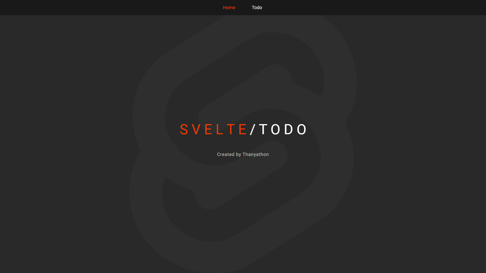

# Svelte Todo

Deploy [here](https://bloodzmoon.github.io/svelte-todo/) with Github Page

## Differrent framework

- [React](https://github.com/bloodzmoon/react-todo)
- [Angular](https://github.com/bloodzmoon/angular-todo)
- [Vue](https://github.com/bloodzmoon/vue-todo)

## Credit

Created by [me](https://github.com/bloodzmoon) with ❤
